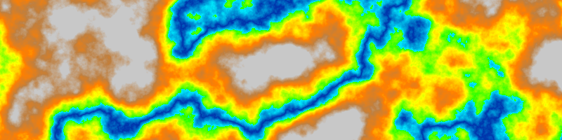
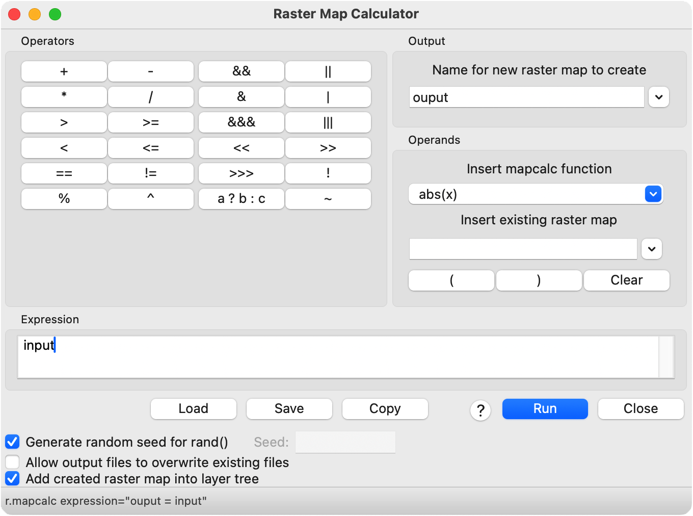
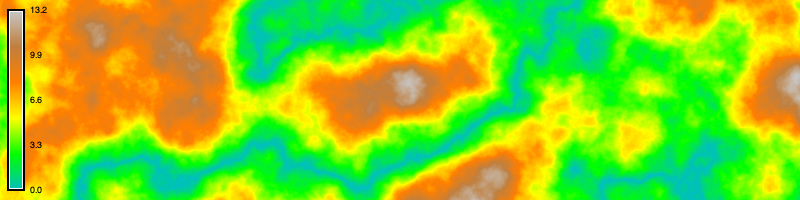
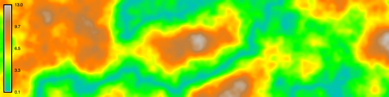
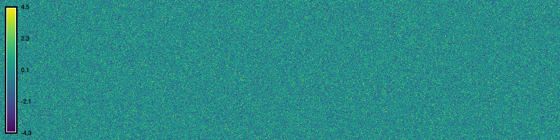
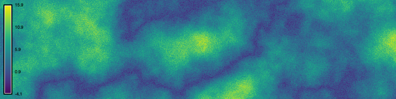

::: {.callout-note title="Computational notebook"}
This tutorial can be run as a 
[computational notebook](https://grass-tutorials.osgeo.org/content/tutorials/map_algebra/basic_map_algebra.ipynb).
Learn how to work with notebooks with the tutorial
[Get started with GRASS & Python in Jupyter Notebooks](../get_started/fast_track_grass_and_python.qmd).
:::

# Map Algebra
This tutorial is a gentle introduction 
to the basics of map algebra in GRASS. 
You will begin to learn how to think procedurally 
about space using math, logic, and flow control. 
Map algebra is an algebraic approach
to modeling fields of data such as rasters.
It can be used to create, summarize, transform, 
or combine multiple rasters. 
Map algebra is powerful; 
it can be used to model natural and anthropogenic phenomena 
in space and even time. 
Algebraic operations on raster maps can be classified 
as local, focal, zonal, or global.
Local operations act on each raster cell in isolation.
Focal operations act on a neighborhood around each cell.
Zonal operations act on groups of cells. 
Global operations act on all cells in the raster.
While there are many tools for map algebra in GRASS, 
this tutorial focuses on local algebraic operations 
using the raster map calculator
[r.mapcalc](https://grass.osgeo.org/grass-stable/manuals/r.mapcalc.html). 
It also briefly introduces focal operations with
[r.neighbors](https://grass.osgeo.org/grass-stable/manuals/r.neighbors.html),
zonal operations using logic and flow control with
[r.mapcalc](https://grass.osgeo.org/grass-stable/manuals/r.mapcalc.html),
and global operations with
[r.info](https://grass.osgeo.org/grass-stable/manuals/r.info.html). 

The raster map calculator
[r.mapcalc](https://grass.osgeo.org/grass-stable/manuals/r.mapcalc.html)
uses map algebra expressions to transform rasters. 
The left side of the expression is the output raster map,
while the right side is the input syntax including
rasters, operators, functions, and variables.
The raster calculator can be used for the simplest of tasks such as 
copying rasters, creating constant rasters, scaling rasters,
patching rasters together, or adding rasters together.
It can also be used more sophisticated tasks such as 
normalizing rasters,
processing imagery,
calculating vegetation indices,
implementing mathematical models,
and generating synthetic data. 
In this tutorial, we will use map algebra to generate terrain
with mountains, river valleys, plateaus, and forests. 
We will use the following operators, functions, and internal variables:

::: {#tbl-panel layout-ncol=3}
| Operator     | Syntax |
|--------------|--------|
| Addition     | `+`    |
| Division     | `\`    |
| Greater than | `>`    |
| Less than    | `<`    |

| Function       | Syntax      |
|----------------|-------------|
| Absolute value | `abs(x)`    |
| If             | `if(x)`     |
| If then else   | `if(x,a,b)` |

| Variable | Syntax   |
|----------|----------|
| Null     | `null()` |

Map algebra operators, functions, and variables in this tutorial
:::

# Terrain generation
Use map algebra to model a landscape 
with mountains, valleys, weathering, forest, plateaus, and rivers. 

## Setup
Start a GRASS session in a new project with a Cartesian coordinate system.
Use [g.region](https://grass.osgeo.org/grass-stable/manuals/g.region.html)
to set the extent and resolution of the computational region.
Since we are working in a Cartesian coordinate system,
we can simply create a region starting at the origin
and extending two hundred units north and eight hundred units east.  

::: {.panel-tabset group="language"}
### Command line
```{bash}
g.region n=200 e=800 s=0 w=0 res=1
```
### Python
```{python}
# Import libraries
import os
import sys
import subprocess
from pathlib import Path

# Find GRASS Python packages
sys.path.append(
  subprocess.check_output(
    ["grass", "--config", "python_path"],
    text=True
    ).strip()
  )

# Import GRASS packages
import grass.script as gs
import grass.jupyter as gj

# Create a temporary folder where to place our GRASS project
import tempfile
temporary = tempfile.TemporaryDirectory()

# Create a project in the temporary directory
gs.create_project(path=temporary.name, name="xy")

# Start GRASS in this project
session = gj.init(Path(temporary.name, "xy"))

# Print projection
projection = gs.read_command("g.proj", flags="p")
print(projection)

# Use temporary region
gs.use_temp_region()

# Set region
gs.run_command("g.region", n=200, e=800, s=0, w=0, res=1)
```
:::

## Plains
It is very easy to create constant rasters with map algebra. 
So start by generating flat terrain using the raster map calculator
[r.mapcalc](https://grass.osgeo.org/grass-stable/manuals/r.mapcalc.html). 
Write the expression `elevation=0`
to create a new elevation raster
set to a constant height of zero.

::: {.panel-tabset group="language"}
### Command line
```{bash}
r.mapcalc expression="elevation = 0"
```
### Python
```{python}
# Map algebra
gs.mapcalc("elevation=0")

# Visualize
m = gj.Map(width=800)
m.d_rast(map="elevation")
m.show()
```
:::


## Mountains
Use [r.surf.fractal](https://grass.osgeo.org/grass-stable/manuals/r.surf.fractal.html)
to generate a fractal surface that simulates mountainous terrain.
If you want reproducible results, set a seed. 
Find the height of the mountains by printing the elevation range with 
[r.info](https://grass.osgeo.org/grass-stable/manuals/r.info.html).
This report is an example of global map algebra operation 
that acts on the entire raster.

::: {.panel-tabset group="language"}
### Command line
```{bash}
r.surf.fractal output=fractal dimension=2.25
r.info -r map=fractal format=plain
```
### Python
```{python}
# Generate fractal surface
gs.run_command("r.surf.fractal", output="fractal", dimension=2.25)

# Visualize
m.d_rast(map="fractal")
m.d_legend(raster="fractal", at=(5, 95, 1, 3))
m.show()

# Print range
info = gs.read_command("r.info", map="fractal", flags="r")
print(info)
```
:::



Since our fractal mountains are too high, 
rescale them with the raster map calculator
[r.mapcalc](https://grass.osgeo.org/grass-stable/manuals/r.mapcalc.html).
Write the expression `elevation = fractal / 10`
to create a new elevation raster
equal to the fractal surface divided by ten. 
This is a local map algebra operation using simple arithmetic.
Print the rescaled elevation range with 
[r.info](https://grass.osgeo.org/grass-stable/manuals/r.info.html).

::: {.panel-tabset group="language"}
### Command line
```{bash}
r.mapcalc expression="elevation = fractal / 10"
r.colors map=elevation color=elevation
r.info -r map=elevation format=plain
```
### Python
```{python}
# Map algebra
gs.mapcalc("elevation = fractal / 10")
gs.run_command("r.colors", map="elevation", color="elevation")

# Visualize
m.d_rast(map="elevation")
m.d_legend(raster="elevation", at=(5, 95, 1, 3))
m.show()

# Print range
info = gs.read_command("r.info", map="elevation", flags="r")
print(info)
```
:::


## Valleys
Use the raster map calculator
[r.mapcalc](https://grass.osgeo.org/grass-stable/manuals/r.mapcalc.html)
to model river valleys winding through in our fractal mountains. 
Write the expression `elevation = abs(elevation)`
to create a new elevation raster
equal to absolute value of the fractal surface.
Because our fractal terrain has values
both below and above mean sea level, i.e. zero, 
taking its absolute value 
will raise the low-lying valleys into mountains. 
The elevation gradient close to zero will become river valleys
at the feet of the mountains. 
Use [r.colors](https://grass.osgeo.org/grass-stable/manuals/r.colors.html)
to assign a color gradient to the elevation raster,
ensuring that the gradient fits rescaled elevation range of the raster.

::: {.panel-tabset group="language"}
### Command line
```{bash}
r.mapcalc expression="elevation = abs(elevation)" --overwrite
r.colors map=elevation color=elevation
```
### Python
```{python}
# Map algebra
gs.mapcalc("elevation = abs(elevation)", overwrite=True)
gs.run_command("r.colors", map="elevation", color="elevation")

# Visualize
m.d_rast(map="elevation")
m.d_legend(raster="elevation", at=(5, 95, 1, 3))
m.show()
```
:::



## Weathering
Use nearest neighbors analysis with 
[r.neighbors](https://grass.osgeo.org/grass-stable/manuals/r.neighbors.html)
to smooth the elevation raster, 
simulating the weathering of old mountains. 
Set the input raster to our `elevation` raster, 
the output raster to a new `weathering` raster,
the neighborhood size to `9`,
the method to `average`,
and flag `c` for a circular neighborhood.
This will create a circular moving window nine pixels wide
that moves from cell to cell across the raster.
The moving window will calculate the average value
of the neighborhood of cells around each cell,
smoothing the raster. 
The size of the moving window,
which must be an odd integer value of three or greater,
determines the degree of smoothing. 
This is an example of a focal map algebra operation.

::: {.panel-tabset group="language"}
### Command line
```{bash}
r.neighbors -c input=elevation output=weathering size=9
```
### Python
```{python}
# Nearest neighbors
gs.run_command(
  "r.neighbors",
  input="elevation",
  output="weathering",
  size=9,
  method="average",
  flags="c",
  overwrite=True
  )

# Visualize
m.d_rast(map="weathering")
m.d_legend(raster="weathering", at=(5, 95, 1, 3))
m.show()
```
:::



## Forest
Use 
[r.surf.gauss](https://grass.osgeo.org/grass-stable/manuals/r.surf.gauss.html)
to create a random surface with a Gaussian or normal distribution,
simulating the height of the forest canopy. 
Set the output raster to a new `gaussian` raster,
mean to `4`, and sigma to `1`. 
While this example uses a Gaussian distribution, 
there are many other probability distributions. 
For randomness with a standard normal distribution, use 
[r.surf.random](https://grass.osgeo.org/grass-stable/manuals/r.surf.random.html)
instead. 

::: {.panel-tabset group="language"}
### Command line
```{bash}
r.surf.gauss output=gaussian mean=4 sigma=1
```
### Python
```{python}
# Generate Gaussian surface
gs.run_command("r.surf.gauss", output="gaussian", mean=4, sigma=1)

# Visualize
m.d_rast(map="gaussian")
m.d_legend(raster="gaussian", at=(5, 95, 1, 3))
m.show()
```
:::


Use the raster map calculator
[r.mapcalc](https://grass.osgeo.org/grass-stable/manuals/r.mapcalc.html)
to add the height of the forest canopy to the elevation gradient,
simulating the forested terrain. 
Write the expression `forest = elevation + gaussian`
to create a new raster equal to 
the sum of the elevation raster
and the Gaussian random surface.
This is a local map algebra operation
using basic arithmetic 
between two rasters.

::: {.panel-tabset group="language"}
### Command line
```{bash}
r.mapcalc expression="forest = elevation + gaussian"
```
### Python
```{python}
# Map algebra
gs.mapcalc("forest = elevation + gaussian")

# Visualize
m.d_rast(map="forest")
m.d_legend(raster="forest", at=(5, 95, 1, 3))
m.show()
```
:::


## Plateaus
Use map algebra to transform the mountain peaks into plateaus.
First use the raster map calculator
[r.mapcalc](https://grass.osgeo.org/grass-stable/manuals/r.mapcalc.html)
with an `if` statement to find all cells with an elevation above thirty. 
Write the expression `plateaus = if(elevation > 30)`.
Simple if statements with the form `if(x)`
where `x` is an equality or inequality statement
return a raster with ones where the statement is true
and zeros where it is false.
So this expression will return a new raster 
with ones where the plateaus will be
and zeros elsewhere. 
This is a zonal map algebra operation
using logic to isolate a zone of cells.

::: {.panel-tabset group="language"}
### Command line
```{bash}
r.mapcalc expression="plateaus = if(elevation > 30)"
```
### Python
```{python}
# Map algebra
gs.mapcalc("plateaus = if(elevation > 30)")

# Visualize
m.d_rast(map="plateaus")
m.show()
```
:::



Now use the raster map calculator
[r.mapcalc](https://grass.osgeo.org/grass-stable/manuals/r.mapcalc.html)
to model the plateaus using an `if then else` statement. 
In map algebra, the syntax for these logical statements is `if(x, a, b)` 
where if the relational statement `x` is true, then do `a`, else do `b`.
Write the expression `elevation = if(elevation > 30, 30, elevation)`.
All cells with elevation values greater than thirty
will be assigned a value of thirty, 
while all other cells will keep their original values.
This will flatten all of the mountain peaks above the threshold of thirty,
forming plateaus. 

::: {.panel-tabset group="language"}
### Command line
```{bash}
r.mapcalc expression="elevation = if(elevation > 30, 30, elevation)" --overwrite
r.colors map=elevation color=elevation
```
### Python
```{python}
# Map algebra
gs.mapcalc("elevation = if(elevation > 30, 30, elevation)", overwrite=True)
gs.run_command("r.colors", map="elevation", color="elevation")

# Visualize
m.d_rast(map="elevation")
m.d_legend(raster="elevation", at=(5, 95, 1, 3))
m.show()
```
:::



## Rivers
Use map algebra to model a river that fills the valleys.
With the raster map calculator
[r.mapcalc](https://grass.osgeo.org/grass-stable/manuals/r.mapcalc.html)
write the expression `river = if(elevation < 6, 6 - elevation, null())`
to simulate the depth of the river. 
This is more complicated map algebra expression
that combines logic with an `if then else` statement,
arithmetical operations between rasters,
and the internal variable `null()`.
If cells in the elevation raster 
have values less than six,
then they will be assigned the difference
between six and the elevation raster, 
else they will be assigned null values. 
Then use [r.colors](https://grass.osgeo.org/grass-stable/manuals/r.colors.html)
to assign the `water` color gradient to the river raster.
The null cells will be transparent, 
so the river depth raster can be layered over the elevation raster.

::: {.panel-tabset group="language"}
### Command line
```{bash}
r.mapcalc expression="rivers = if(elevation < 6, 6 - elevation, null())"
r.colors map=rivers color=water
```
### Python
```{python}
# Map algebra
gs.mapcalc("rivers = if(elevation < 6, 6 - elevation, null())")
gs.run_command("r.colors", map="rivers", color="water")

# Visualize
m.d_rast(map="elevation")
m.d_rast(map="rivers")
m.d_legend(raster="rivers", at=(5, 95, 1, 3))
m.show()
```
:::

